<div align="center">

# Atlas

**Personal AI Agent for Claude Code**

[](https://claude.ai)
[](https://www.typescriptlang.org/)
[](https://bun.sh)

</div>

---

> **AI Agents:** Read [CLAUDE.md](CLAUDE.md) for development instructions.

## What is Atlas?

Atlas extends [Claude Code](https://docs.anthropic.com/en/docs/claude-code) with modular capabilities that make your AI assistant *yours* - persistent memory, life goals context, voice feedback, and more.


| Module | What it does |
|--------|--------------|
| **voice** | Speaks task completions aloud (ElevenLabs/Google TTS) |
| **core** | Loads identity, preferences, and TELOS (life goals) at session start |
| **security** | Blocks dangerous commands (rm -rf, reverse shells, etc.) |
| **observability** | Real-time dashboard showing what Claude is doing |
| **statusline** | Shows git branch, model, and usage in your terminal |
| **skills** | 12 skills: Algorithm, Art, Browser, Agents, Upgrades, and more |
| **commands** | 16 slash commands (`/atlas:help`, `/atlas:status`, etc.) |
| **memory** | Persistent memory across sessions (State, Learnings, Signals) |

---

## Prerequisites

1. **Claude Code** - [Install from Anthropic](https://docs.anthropic.com/en/docs/claude-code)
2. **Bun** - [Install from bun.sh](https://bun.sh)
   ```bash
   curl -fsSL https://bun.sh/install | bash
   ```

---

## Installation

### Option 1: Interactive Wizard (Recommended)

```bash
git clone https://github.com/edheltzel/atlas.git
cd atlas
./exports/wizard.sh
```

The wizard will:
1. Let you select which modules to install
2. Ask for your AI's name (default: Atlas)
3. Ask for your name (for personalized greetings)

### Option 2: Install Specific Modules

```bash
git clone https://github.com/edheltzel/atlas.git
cd atlas

# Basic install
./exports/wizard.sh --install voice core security

# With identity configuration
./exports/wizard.sh --install --ai-name "Jarvis" --user-name "Tony" voice core security
```

### Option 3: Full Install (Everything)

```bash
git clone https://github.com/edheltzel/atlas.git
cd atlas
./install.sh
```

### Option 4: With GNU Stow (for dotfiles users)

```bash
cd ~/.dotfiles
git submodule add https://github.com/edheltzel/atlas.git atlas
stow atlas
```

---

## Key Features

### TELOS - Life Operating System

Your AI sees your priorities at every session start. No more re-explaining your situation.


Define your life areas in `~/.claude/skills/CORE/USER/TELOS.md`. This loads automatically, giving your AI context about what matters to you.

---

### MEMORY System

Persistent memory that survives sessions. "Continue where we left off" actually works.

```mermaid
flowchart LR
    subgraph HOT["🔥 HOT"]
        STATE[State/<br/>active-work.json]
        WORK[Work/<br/>Task traces]
    end

    subgraph WARM["💡 WARM"]
        LEARNING[Learning/<br/>Phase insights]
        SIGNALS[Signals/<br/>Patterns]
    end

    subgraph COLD["❄️ COLD"]
        SESSIONS[sessions/]
        ARCHIVE[archive/]
    end

    HOT -->|curates to| WARM
    WARM -->|archives to| COLD
```



| Tier | Directory | Purpose |
|------|-----------|---------|
| **HOT** | `State/`, `Work/` | Active task, current traces |
| **WARM** | `Learning/`, `Signals/` | Curated insights, pattern detection |
| **COLD** | `sessions/`, `archive/` | Full historical record |

---

### Upgrades Skill

Stay current with Claude Code updates:

```
"check for updates"       → Scans 30+ Anthropic sources
"any new Claude features?" → Checks blogs, GitHub, changelogs
"deep dive release notes"  → Parallel research on each feature
```

---

## Configuration

### Voice System

Atlas speaks task completions aloud using ElevenLabs or Google Cloud TTS.


**Setup:**

```bash
# ElevenLabs (recommended - higher quality)
echo "ELEVENLABS_API_KEY=your_key_here" >> ~/.claude/.env

# Google Cloud TTS (fallback - free tier: 4M chars/month)
echo "GOOGLE_API_KEY=your_key_here" >> ~/.claude/.env
```

**Voice Customization:**

Configure voices in `~/.claude/atlas.yaml`:

```yaml
voice:
  provider: elevenlabs          # or 'google'
  default_volume: 0.8           # 0.0 - 1.0
  voices:
    default: "your-voice-id"
    engineer: "voice-id-1"
    architect: "voice-id-2"
    researcher: "voice-id-3"
```

Find voice IDs at [ElevenLabs Voice Library](https://elevenlabs.io/voice-library). Switch voices with:

```bash
/atlas:voice engineer   # Switch to Rachel
/atlas:voice architect  # Switch to Bella
/atlas:voices           # List available voices
```

---

### Identity

Your AI assistant has a configurable identity that personalizes every interaction.


**During Installation:**

The wizard prompts for identity configuration:

```
━━━ Identity Configuration ━━━

AI Assistant name [Atlas]: Jarvis
Your name: Tony

Identity configured:
  AI Name: Jarvis
  User: Tony
```

**What Gets Configured:**

| File | What Changes |
|------|--------------|
| `~/.claude/skills/CORE/SKILL.md` | AI name, user name, "who I work for" |
| `~/.claude/hooks/load-core-context.ts` | Session greeting voice line |

**To Change Later:**

```bash
code ~/.claude/skills/CORE/SKILL.md
```

Edit the Identity section:

```markdown
## Identity

**Assistant:**
- Name: Jarvis
- Role: Tony's AI assistant

**User:**
- Name: Tony
```

### TELOS (Life Goals)

```bash
code ~/.claude/skills/CORE/USER/TELOS.md
```

Define your life areas, current focus, and active projects.

---

## Usage

```bash
claude
```

Atlas loads automatically. Try these commands:

| Command | What it does |
|---------|--------------|
| `/atlas:help` | Show all available commands |
| `/atlas:status` | Check system health |
| `/atlas:algorithm` | Run structured task execution |
| `/atlas:voice engineer` | Switch voice personality |

---

## Adding/Removing Modules Later

```bash
./exports/wizard.sh --install observability
```

Or from within Claude Code: `/atlas:modules`

---

## Local Commands

Create machine-specific commands that aren't tracked in git.

Place custom commands in `~/.claude/commands/local/`:

```bash
~/.claude/commands/local/
├── README.md          # Tracked (explains the directory)
└── my-command.md      # Not tracked (your private commands)
```

Commands become available as `/local:<name>`. For example, `sync-tools.md` becomes `/local:sync-tools`.

**Use cases:**
- Commands referencing local paths (`~/Developer/...`)
- Sync scripts for local repositories
- Machine-specific workflows

---

## Troubleshooting

| Problem | Solution |
|---------|----------|
| Voice not working | Check `~/.claude/.env` has API key |
| Hooks not running | Run `bun --version` to verify bun installed |
| Module not loading | Run `/atlas:status` to diagnose |

---

## Inspiration

Atlas builds on ideas and patterns from these projects:

| Project | Author | Inspiration |
|---------|--------|-------------|
| [Personal AI Infrastructure (PAI)](https://github.com/danielmiessler/Personal_AI_Infrastructure) | Daniel Miessler | Core architecture, skill system, Algorithm |
| [Telos](https://github.com/danielmiessler/Telos) | Daniel Miessler | Life operating system concept |
| [Always-On AI Assistant](https://github.com/disler/always-on-ai-assistant) | Disler | Persistent AI assistant patterns |
| [POC Realtime AI Assistant](https://github.com/disler/poc-realtime-ai-assistant) | Disler | Real-time voice interaction |

---

## License

MIT License - See [LICENSE](LICENSE) for details.
